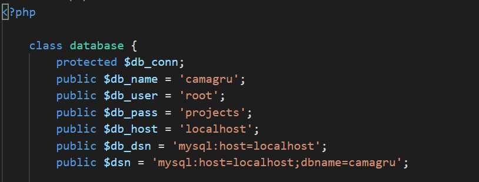

# CAMAGRU


Camagru is the first web project from the 42 / WeThinkCode_ curriculum, that aims to create a simple image editing and sharing application that allows users to post or upload images with frames or stickers, which other users within the application can comment and / or like.

The main purpose for this project was to teach the basic fundamentals of web development using CSS, HTML, JS with PHP acting as the backend / server side language.

# Installation

## Prerequisites

A local apache server to host on, in this case we will use a bitnami local server environment
    - [Bitnami local server environments](https://bitnami.com/stacks/infrastructure)

### MacOS
    - Install [Bitnami MAMP](https://bitnami.com/stack/mamp)

### Windows
    - Install [Bitnami WAMP](https://bitnami.com/stack/wamp)

### Linux
> Note - this project has not been tested on a linux based system
    - Install [Bitnami LAMP](https://bitnami.com/stack/lamp)

# Clone
Clone this repo to your local machine using:
```
cd [Insert path to your MAM/WAMP/LAMP directory]/apache2/htdocs
git clone https://github.com/tmadau/Camagru.git
```

# Setup
## Configuring Server Environment

Locate and run the executable file


Start the server


Browse to site location
http://localhost/Camagru
> Note - by default the server is set to port 80

## Configuring Camagru

### Changing Camagru Variables

In [Insert path to your MAP/WAMP/LAMP directory]/apache2/htdocs/Camagru/config/database.php

Change the password of `$db_pass`, to the password you set during bitnami installation/setup.



### Creating Database and Table

To create database and tables:

In the browser, navigate to
http://localhost/Camagru/config/setup.php


# Samples | Screenshots
## Landing | Home page


## Photobooth


### Uploading an image


### Taking a photo with the webcam


# Project Insight
## Project Brief
- [Camagru Project Brief](./uploads/camagru.en.pdf)
## Project Markingsheet
- [Camagru Project Marking sheet](./uploads/camagru.markingsheet.pdf)